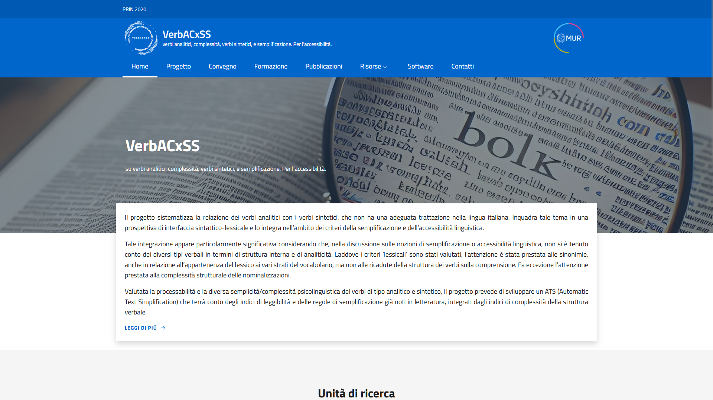

# VerbACxSS website
This is the official website of VerbACxSS, a project funded by the Italian Ministero dell'Università e della Ricerca.

## Getting started
### Pre-requisites
This web application is developed using Angular framework and Design Angular Kit library. The following software are required to run the application:
* Node (tested on version 22.14.0)
* npm (tested on version 11.2.0)

Alternatively, you can use a containerized version by installing:
* Docker (tested on version 28.0.1)

### Using `node` and `npm`
Install the dependencies
```sh
npm install
```

Run the application
```sh
npm run serve-local
```

### Using `docker`
Run the application using `docker compose`
```sh
docker compose up --build -d
```

## Usage
The web application will be running at `http://localhost:8080`.



## Built With
* [Angular](https://angular.io/)
* [Design Angular Kit](https://github.com/italia/design-angular-kit/)

## License
This project is licensed under the MIT License - see the [LICENSE](LICENSE) file for details.

## Acknowledgements
This contribution is a result of the research conducted within the framework of the PRIN 2020 (Progetti di Rilevante Interesse Nazionale) "VerbACxSS: on analytic verbs, complexity, synthetic verbs, and simplification. For accessibility" (Prot. 2020BJKB9M), funded by the Italian Ministero dell'Università e della Ricerca.
